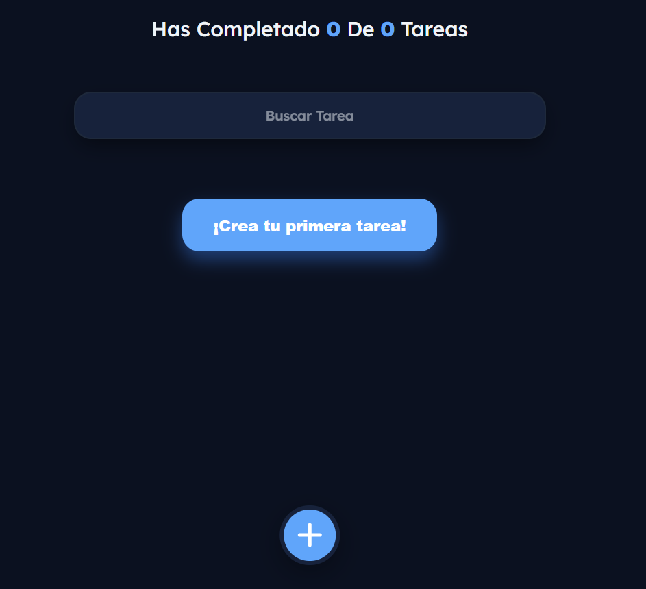
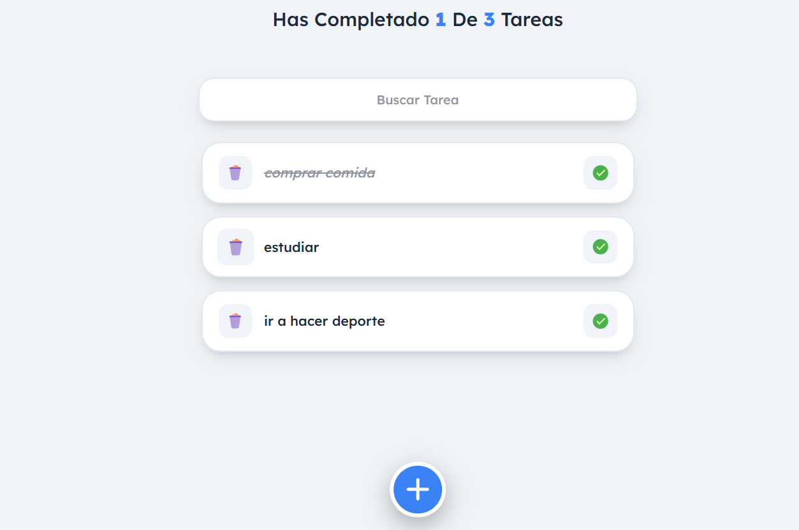
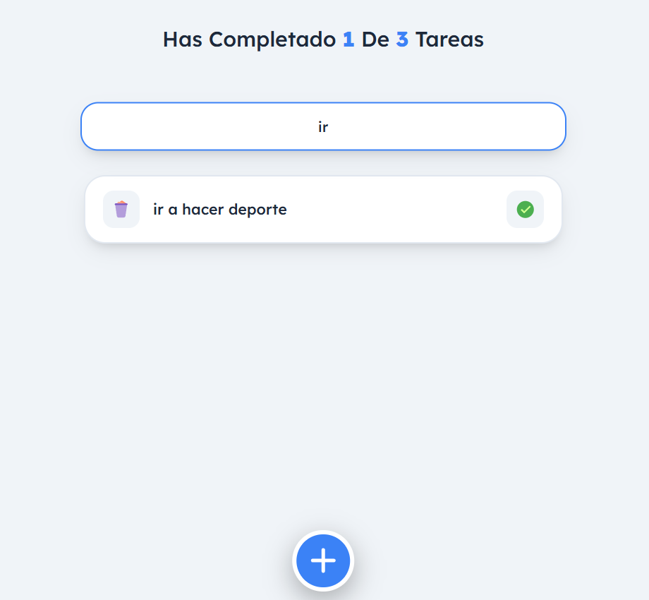

# ✅ Tareapp - Gestión Inteligente de Tareas

**Tareapp** es una aplicación moderna de gestión de pendientes diseñada para ofrecer una experiencia fluida, rápida y estéticamente impecable. Enfocada en la productividad y el diseño limpio, permite organizar tu día a día con facilidad.

🌐 **Despliegue oficial:** [Ver Tareapp en vivo](https://christiamgsp.github.io/tareapp/)



## 🎨 Características de Vanguardia

- **🌓 Modo Oscuro Premium:** Interfaz adaptable con paleta "Midnight Deep Blue" para una lectura cómoda en entornos oscuros.
- **📱 Responsive Design:** Experiencia optimizada para móviles, tablets y escritorio.
- **💾 Persistencia de Datos:** Integración con `localStorage` para que tus tareas nunca se pierdan al cerrar el navegador.
- **⚡ Búsqueda Dinámica:** Filtrado de tareas en tiempo real con respuesta instantánea.
- **🎯 UX Minimalista:** Botones flotantes ergonómicos y transiciones suaves para una navegación sin fricciones.

---

## 📸 Capturas de Pantalla

<div align="center">
  
  
</div>
<br />
<div align="center">
  
</div>

---

## 🛠️ Stack Tecnológico

- **React.js:** Desarrollo basado en componentes y estados eficientes.
- **Context API:** Gestión de estado global para temas y lógica de tareas.
- **Custom Hooks:** Lógica desacoplada para el manejo de almacenamiento local.
- **CSS Modules:** Estilos aislados y variables dinámicas para el cambio de tema.
- **React Icons:** Set de iconos profesionales y minimalistas.

---

## 🚀 Guía de Inicio Rápido

1. **Clonación:**
   ```bash
   git clone [https://github.com/christiamgsp/tareapp.git](https://github.com/christiamgsp/tareapp.git)
   ```
